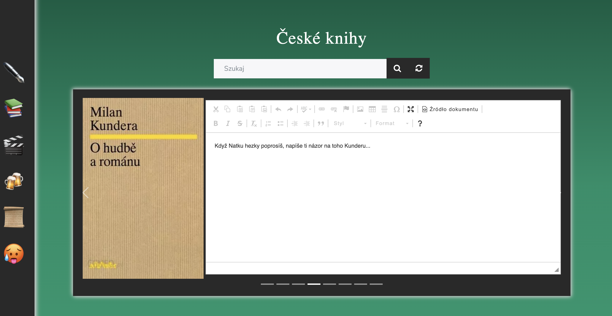

# Natkapp - tribute to Milan Kundera

Personalized website for adoring Milan Kundera novels. It allows to use TMDB web API and its own storage of names and covers from Polish publisher Wydawnictwo WAB.

<p align="center">
  
</p>

## Usage (Linux/macOS)
```
python3 -m venv env
source env/bin/activate
pip install -r requirements.txt
python3 app.py
```
